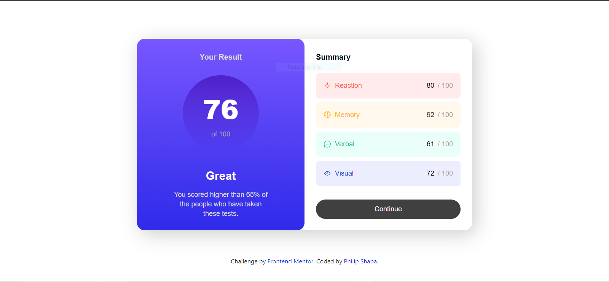
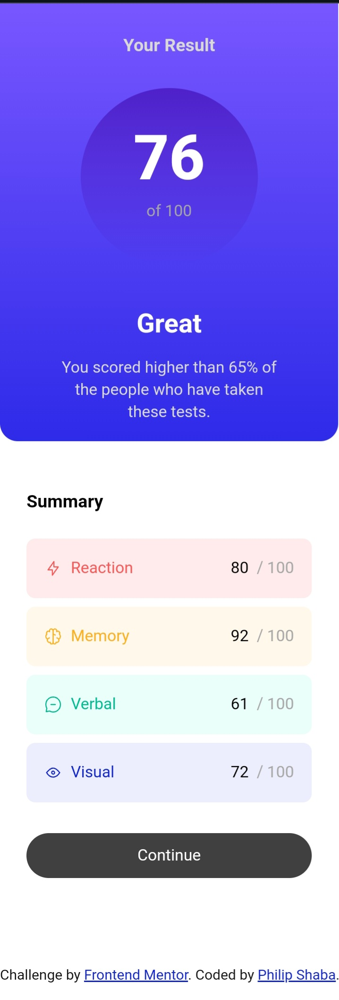

# Frontend Mentor - Results summary component solution

This is a solution to the [Results summary component challenge on Frontend Mentor](https://www.frontendmentor.io/challenges/results-summary-component-CE_K6s0maV). Frontend Mentor challenges help you improve your coding skills by building realistic projects. 

## Table of contents

- [Overview](#overview)
  - [The challenge](#the-challenge)
  - [Screenshot](#screenshot)
  - [Links](#links)
- [My process](#my-process)
  - [Built with](#built-with)
  - [What I learned](#what-i-learned)
  - [Extra Feature](#extra-feature)
  - [Continued development](#continued-development)
  - [Useful resources](#useful-resources)
- [Author](#author)
- [Acknowledgments](#acknowledgments)

## Overview

### The challenge

Users should be able to:

- View the optimal layout for the interface depending on their device's screen size
- See hover and focus states for all interactive elements on the page
- **Bonus**: Use the local JSON data to dynamically populate the content

### Screenshot

                                                      Desktop view



                                                      Mobile view



### Links

- [Solution URL](https://github.com/SHABA01/results-summary-component)
- [Live Site URL](https://shaba01.github.io/results-summary-component)

## My process

### Built with

- Semantic HTML5 markup
- CSS custom properties
- Flexbox
- CSS Grid
- Mobile-first workflow
- Vanilla JavaScript

### What I learnt

One of the key things I learnt from this project was the use of `mainDiv.innerHTML` method, in conjunction with template literals and dynamic data manipulation, showcases an effective approach to dynamically generating and rendering HTML content within a web application.

```javascript
 function renderApp(data) {
  const mainDiv = document.getElementById('main');
  mainDiv.innerHTML = `
      <main>
          <section id="section1">
              <h1>Your Result</h1>
              <div class="circle">
                  <p class="p1">76</p>
                  <p class="p2"> of 100</p>
              </div>
              <p class="txt-great">Great</p>
              <p class="p3">You scored higher than 65% of</p>
              <p class="p3">the people who have taken</p>
              <p class="p3">these tests.</p>
          </section>
          <section id="section2">
              <h2>Summary</h2>
              ${data.map(category => `
                  <div class="div-${category.category.toLowerCase()}">
                      <div class="icon-and-text">
                          
                          <p class="txt-${category.category.toLowerCase()}">${category.category}</p>
                      </div>
                      <div class="spacer"></div>
                      <div class="scores">
                          <p class="score">${category.score}</p>
                          <div class="spacer2"></div>
                          <p class="score-out-of">/ 100</p>
                      </div>
                  </div>
              `).join('')}
              <button id="continueButton">Continue</button>
          </section>
      </main>
  `;

  const continueButton = document.getElementById('continueButton');
  continueButton.addEventListener('click', handleContinueButtonClick);
}
```
I also learnt:

 1. __Dynamic HTML Generation:__ The `mainDiv.innerHTML` method is utilized to dynamically generate the HTML content of the mainDiv element. This allows for the insertion of dynamic data fetched from the `data` parameter.

 2. __Template Literal Usage:__ Template literals (enclosed in backticks ``) are used for creating multi-line strings, making the HTML structure more readable and maintainable within the JavaScript code.
 
 3. __Data Interpolation:__ The `${}` syntax within the template literals allows for easy interpolation of dynamic data values, such as `category.category`, `category.icon`, and `category.score`. This enables the insertion of category-specific data retrieved from the `data` array.
 
 4. __Array Mapping:__ The `data.map()` function is used to iterate over each object in the `data` array and dynamically generate HTML markup for each category. This demonstrates the flexibility of JavaScript's array manipulation methods for generating dynamic content.
 
 5. __Event Binding:__ Additionally, the `addEventListener` method is employed to bind an event listener to the `continueButton`, enabling interaction with the dynamically generated content.
 
 6. __Code Readability and Maintainability:__ By encapsulating the HTML structure within the JavaScript code using template literals, the readability and maintainability of the code are enhanced, as it becomes easier to visualize and modify the structure of the generated HTML.

### Extra Feature

__User Confirmation Prompt__

In addition to rendering the application interface, an extra feature has been implemented to enhance user interaction. Upon clicking the "Continue" button, a confirmation prompt is triggered, giving users the option to proceed to the next set of tests or to retake the previous ones. This feature provides users with control over their testing experience and ensures clarity before advancing.

```javascript
 function handleContinueButtonClick() {
  const userConfirmed = confirm("Do you want to go on to the next set of tests or retake the previous ones?");

  if (userConfirmed) {
      console.log("User confirmed. Proceeding to the next set of tests...");
  } else {
      console.log("User canceled. Staying on the current set of tests...");
  }
}
```
When the user clicks the "Continue" button, a confirmation dialog appears, presenting the options. If the user confirms their choice, a corresponding message is logged to the console, indicating the decision made. Conversely, if the user cancels, the application maintains the current set of tests, providing a seamless experience tailored to user preferences. This extra feature adds a layer of interactivity and user control, enriching the overall usability of the application.

### Continued development

I plan to continue improving my skills in accessibility, ensuring that the results-summary-component is usable and navigable for all users. Additionally, I aim to explore more advanced CSS techniques for creating responsive and visually appealing interfaces.

### Useful resources

- [MDN Web Docs](https://developer.mozilla.org/en-US) - This comprehensive resource for HTML, CSS, and JavaScript documentation helped me to understand the relationship between linked files and how to reference elements across each file.

## Author

- LinkedIn - [Philip Shaba](https://www.linkedin.com/in/philip-shaba-0879a5150)
- Frontend Mentor - [@SHABA01](https://www.frontendmentor.io/profile/SHABA01)
- X - [@ShabaPhilip1](https://www.twitter.com/ShabaPhilip1)

## Acknowledgments

I would like to acknowledge the Frontend Mentor community for providing this challenge and the resources that helped me enhance my skills during this project.